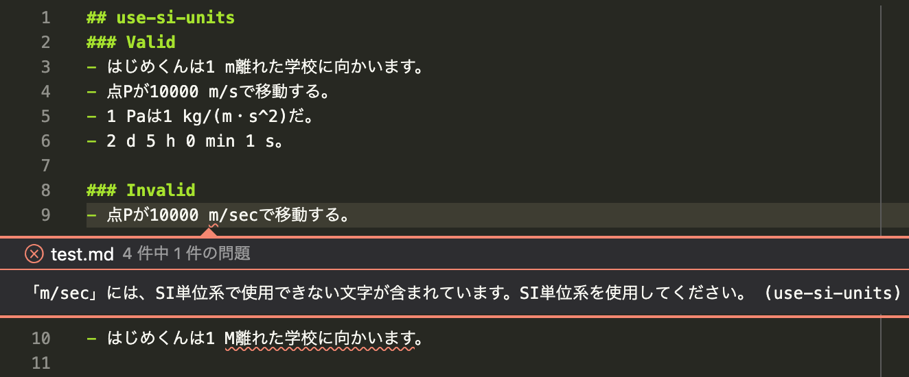

# textlint-rule-use-si-units [](https://github.com/kn1cht/textlint-rule-use-si-units/actions?query=workflow%3ACI) 
## Use SI Units



1. SI単位系の単位以外の使用を禁止します
    - SI単位系は度々改訂されているため、[The International System of Units(SI) 9th edition 2019](https://www.bipm.org/utils/common/pdf/si-brochure/SI-Brochure-9.pdf#page=147)を本ルールの基準とします
    - [JIS Z 8203:2000「国際単位系（SI）及びその使い方」](https://jp.misumi-ec.com/tech-info/categories/technical_data/td01/a0181.html)においても使用法が定められていますが、制定時期の関係で上記の国際文書とは異なる点があります
1. SI単位系の単位とは以下のいずれかの単位、またはそれらの組み合わせ（組立単位）を指します
    - SI基本単位（s, m, kg, A, K, mol, cd）
    - 固有の名称をもつSI組立単位（rad, sr, Hz, N, Pa, Jなど22種）
1. 以下の文字は単体では単位となることができませんが、単位と組み合わせて使用できます
    - SI接頭語（M, G, k, mなど20種）
    - SI単位を組み合わせる際に使用される記号（\, ^, -, ·, ･, ・, (, )）
    - 次元を表すための数字（e.g. m^2）
1. 以下のSI併用単位も許容します
    - SIに属さないが、SIと併用される単位（min, h, d, au, °, ′, ″など16種）
    - これらは`restrictNonSIUnits`オプションで禁止できます

### 指摘の対象とする文字列
- 数値 + 単位の組み合わせを検出します
    - e.g.「10 m」「273 K」「123 kgm^2/s^3」
    - 数値と単位の間には**半角スペース**が入っている必要があります
        - IDや型番のような、単位と関係ない文字列を誤検出するのを防ぐためです

### 指摘の対象としない文字列
- 日本語の単位や助数詞
    - e.g.「枚」「本」「糎」「㌢㍍」
- 小数点や記号入りの数値
    - e.g.「2.56 m/s」「1.1e-10 m」
    - ただし、小数点・記号より後にも数字があればその部分を検出します
- LaTeX等で数値と単位の間に半角スペース以外を使用しているもの
    - e.g.「`10\,m`」「`\SI{123}{kgm^2/s^3}`」「`$123\ \mathrm{kgm^2/s^3}$`」

## Install

Install with [npm](https://www.npmjs.com/):

    npm install textlint-rule-use-si-units

## Usage

Via `.textlintrc`(Recommended)

```json
{
    "rules": {
        "use-si-units": true
    }
}
```

Via CLI

```
textlint --rule use-si-units README.md
```

### Options
- `allowedUnits`
    - この配列にある文字列には、SI単位系に従っていなくとも警告を出しません
- `restrictNonSIUnits`
    - `false` (default): SI併用単位も使用できます
    - `true`: SI併用単位の使用を禁止し、SIに属する単位のみ認めます

```json
{
    "rules": {
        "use-si-units": {
            "allowedUnits": ["Å"],
            "restrictNonSIUnits": true
        }
    }
}
```

### Build

Builds source codes for publish to the `lib` folder.
You can write ES2015+ source codes in `src/` folder.

    npm run build

### Tests

Run test code in `test` folder.
Test textlint rule by [textlint-tester](https://github.com/textlint/textlint-tester).

    npm test

## License

ISC © kn1cht
